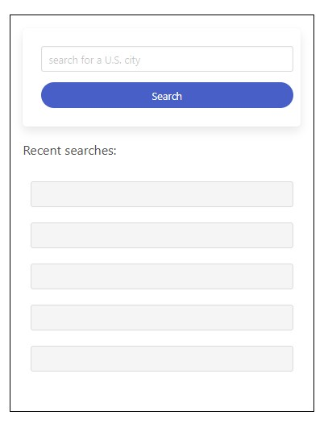
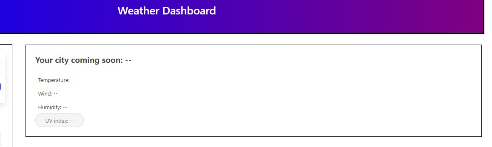
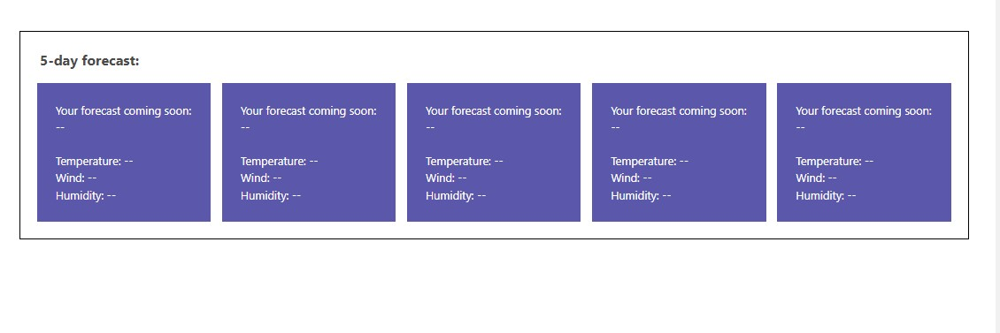
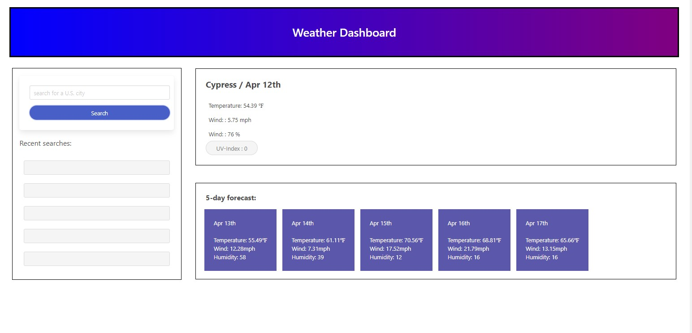

# Weather Dashboard
Welcome to The Weather dashboard; you can search the forecast for any city in the united states.

The current forecast for the day as well as a five day forecast will populate the screen.


## Built with: 
```bash
-Html
-CSS
-Java
-Api's
```

## Search bar


## Current forecast
 

## 5-day forecast


## City example


## Website links

[Github](https://github.com/ashokunb/weather-dashbord-h-c-java-api)

[Website](https://ashokunb.github.io/weather-dashbord-h-c-java-api/)

[LinkedIn](https://www.linkedin.com/in/ambroseshokunbi/)